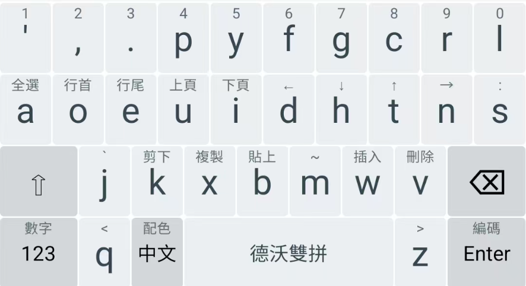

# 德沃双拼
为 Dvorak 键盘布局设计的双拼方案。

## 安裝
本方案依赖于
- [朙月拼音](https://github.com/rime/rime-luna-pinyin) ℞ `luna-pinyin`

[東風破](https://github.com/rime/plum)安装口令： `bash rime-install igaryhe/double-pinyin-dvorak`

将下列代码添加至 `Rime/default.custom.yaml` 中：
```yaml
patch:
  schema_list:
    - schema: double_pinyin_dvorak
```
重新部署 Rime，即可选择使用德沃双拼。

## 布局


本方案主要參考了[小鹤双拼](https://www.flypy.com/pin.html)，同時针对 Dvorak 键盘布局做了一些調整。在降低击键当量的同时，也尝试平衡左右手的工作符合。截图中使用的工具是由[田生](https://github.com/tiansh)提供的[双拼布局的统计计算](https://tiansh.github.io/lqbz/sp/)。

## Trime 安卓配置
新增了 `trime.yaml` 文件，修改了 Trime 输入法在安卓上的表现。

手机端之所以需要调整，是因为 q 和 z 的位置不符合正常布局。

1. 输入方案参考：[double-pinyin-dvorak](https://github.com/igaryhe/double-pinyin-dvorak)
2. 布局参考：[落格输入法-经典版](https://apps.apple.com/us/app/%E8%90%BD%E6%A0%BC%E8%BE%93%E5%85%A5%E6%B3%95-%E7%BB%8F%E5%85%B8%E7%89%88/id1140465593)

### 更改前后对比
更改前：


更改后：

